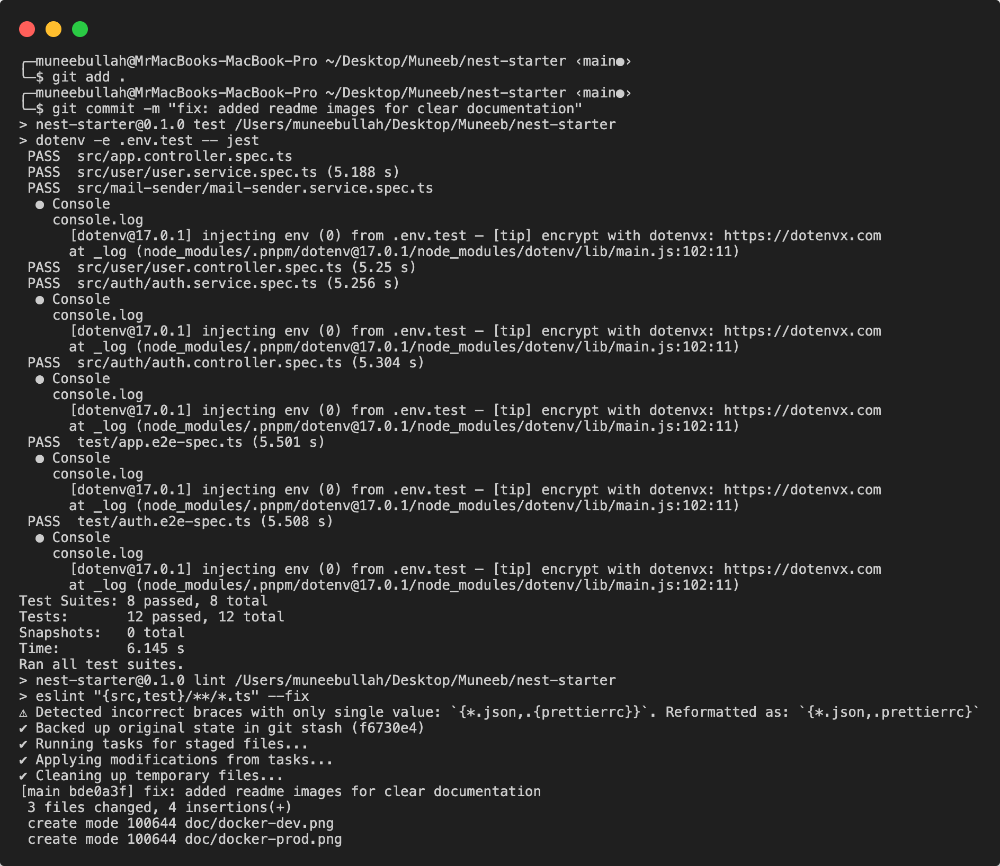

# Nest Starter <a href="https://nestjs.com/" target="_blank"></a>

[](#contributors-)

This project contains boilerplate for creating APIs using [Nest](https://nestjs.com), a progressive [Node.js](http://nodejs.org) framework for building efficient and scalable server-side applications.

It is mostly built to be used as a starting point in hackathons and implements common operations such as sign up, JWT authentication, mail validation, model validation and database access.

Clone this repository by running `git clone https://github.com/moneebullah25/nest-starter.git <YOUR_PROJECT_NAME>` or [directly create your own GitHub repository using this template](https://github.com/moneebullah25/nest-starter/generate).

## Features

1. **PostgreSQL with Prisma** – Easy-to-use and scalable relational database integration with auto-generated types.
2. **JWT Authentication** – Secure login and session management using JSON Web Tokens.
3. **Mail Verification** – User email verification flows through secure token-based links.
4. **Mail Change** – Enable users to change their email with double confirmation via secure tokens.
5. **Password Reset** – Built-in secure password reset mechanism using tokenized links.
6. **Request Validation** – Input validation using class-validator and NestJS pipes.
7. **Customizable Mail Templates** – Dynamic email templates that support your project’s branding.
8. **Swagger API Documentation** – Auto-generated API docs with Swagger UI.
9. **Security Techniques** – Helmet, CORS, and input sanitation baked in.
10. **Logger** – NestJS logger for clean structured logs and error messages.

---

## Getting Started

### Prerequisites

Node.js 16 or newer
pnpm
PostgreSQL (local or Docker)
Docker and Docker Compose

---

## Project Setup

```bash
git clone https://github.com/moneebullah25/nest-starter.git <YOUR_PROJECT_NAME>
cd <YOUR_PROJECT_NAME>
pnpm ci
```

---

## Environment Configuration

Environment files live at the project root. Keep separate files for each environment

`.env.dev`
`.env.test`
`.env.prod`

These files contain sensitive variables such as database URLs, API keys, mail credentials and project metadata.

Example `.env.dev` file

```dotenv
NODE_ENV=development

EXTERNAL_PORT=3000
INTERNAL_PORT=3000

DATABASE_HOST=postgres
DATABASE_PORT=5432
DATABASE_USERNAME=postgres
DATABASE_PASSWORD=postgres
DATABASE_NAME=starter

ADMINER_PORT=8080

DATABASE_URL="postgresql://${DATABASE_USERNAME}:${DATABASE_PASSWORD}@${DATABASE_HOST}:${DATABASE_PORT}/${DATABASE_NAME}"

JWT_SECRET_KEY=your_jwt_secret_key
JWT_EXPIRES_IN=86400

SENDGRID_HOST=smtp.sendgrid.net
SENDGRID_PORT=587
SENDGRID_SECURE=false
SENDGRID_USER=apikey
SENDGRID_PASS=your_sendgrid_api_key

SENDER_NAME=Your Project Name
SENDER_EMAIL=your@email.com

PROJECT_NAME=Your Project
PROJECT_ADDRESS=123 Nest Street, Pakistan
PROJECT_LOGO_URL=https://yourdomain.com/logo.png
PROJECT_SLOGAN=Made with ❤️ in Pakistan
PROJECT_COLOR=#123456

PROJECT_SOCIAL_GITHUB=https://github.com/your-repo
PROJECT_SOCIAL_1_NAME=Twitter
PROJECT_SOCIAL_1_URL=https://twitter.com/yourhandle
PROJECT_SOCIAL_2_NAME=LinkedIn
PROJECT_SOCIAL_2_URL=https://linkedin.com/in/yourprofile

PROJECT_URL=http://localhost:4200
MAIL_VERIFICATION_URL=http://localhost:3000/auth/verify
MAIL_CHANGE_URL=http://localhost:3000/auth/change-email
RESET_PASSWORD_URL=http://localhost:4200/reset-password
TERMS_OF_SERVICE_URL=http://localhost:4200/legal/terms
```

---

## Mail Configuration (Nodemailer and SendGrid)

This project uses [Nodemailer](https://nodemailer.com/about/) with **SendGrid SMTP** for sending transactional emails (verification, password reset, etc).

A delivery provider is required for sending mails with Nodemailer. I mostly use SendGrid to send mails, however, Nodemailer can work with any service with SMTP transport.

To get a SendGrid API key:

- Create a free account from https://signup.sendgrid.com/
- Confirm your account via the activation email and login.
- Create an API Key with mail sending capability.

Enter your API key and sender credentials to env file. Sender credentials are the sender name and sender mail that will be seen by your users.

```dotenv
SENDGRID_HOST=smtp.sendgrid.net
SENDGRID_PORT=587
SENDGRID_SECURE=false
SENDGRID_USER=apikey
SENDGRID_PASS=your_sendgrid_api_key
SENDER_NAME=Your Project Name
SENDER_EMAIL=your@email.com
```

> You can obtain your SendGrid API Key by signing up at [https://sendgrid.com](https://sendgrid.com) and creating an API key with email send permissions.

All email credentials and sender configurations are loaded dynamically via `config.ts` using the current environment file.

---

## Mail Template Configurations

The mail templates are dynamically populated using values defined in your environment file. These values include:

- Project name, address, logo, slogan, and brand color
- Social media URLs
- Important URLs for actions like email verification, password reset, etc.

Mail templates are highly customizable and heavily depend on configurations. Enter your project's information to env file. Urls are used as references in the templates. If your mail verification logic is independent from your front-end application, you can use API's own mail verification endpoint, e.g. http://localhost:3000/auth/verify, as mailVerificationUrl. Otherwise, send a HTTP GET request to verification endpoint with token added as a parameter named token, e.g, http://localhost:3000/auth/verify?token=**VERIFICATION_TOKEN**

Example:

```env
PROJECT_NAME=Your Project
PROJECT_ADDRESS=123 Nest Street, Pakistan
PROJECT_LOGO_URL=https://yourdomain.com/logo.png
PROJECT_SLOGAN=Made with ❤️ in Pakistan
PROJECT_COLOR=#123456
PROJECT_SOCIAL_GITHUB=https://github.com/your-repo
```

> The backend handles generating tokenized verification links like `/auth/verify?token=xyz`.

---

## Swagger API Docs

Swagger UI is available at `/api` when you run the server. It displays all available routes, DTOs, and expected request/response formats.

---

## Database and Prisma

This project uses [Prisma](https://www.prisma.io/) as the ORM for PostgreSQL. Prisma makes it easy to manage and migrate your schema.

After setting your `DATABASE_URL` in the env file, you can run the following commands:

```bash
pnpm run prisma:generate         # Generate Prisma client
pnpm run migrate:dev           # Apply dev migrations
pnpm run prisma:studio           # Open Prisma web GUI
```

Use `seed.ts` files for seeding test data.

---

## Testing

Tests are written using [Jest](https://jestjs.io/) and run inside the `test/` directory.

### Run tests:

```bash
pnpm run test            # Runs all unit tests
pnpm run test:watch      # Watches and reruns tests
pnpm run test:e2e        # End-to-end tests using Jest & Supertest
```

> Uses `.env.test` during tests for isolation.

---

## Husky

Pre-commit and commit-msg hooks are already setup. Pre-commit hook runs tests and linting stuff whereas commit-msg hook make sure that the commit message follows the following convention:

- `feat`: A new feature.
- `fix`: A bug fix.
- `docs`: Documentation changes.
- `style`: Changes that do not affect the meaning of the code (white-space, formatting, missing semicolons, etc.).
- `refactor`: A code change that neither fixes a bug nor adds a feature.
- `perf`: A code change that improves performance.
- `test`: Adding missing tests or correcting existing tests.
- `build`: Changes that affect the build system or external dependencies.
- `ci`: Changes to CI configuration files and scripts.
- `chore`: Other changes that don't modify src or test files.
- `revert`: Reverts a previous commit.



## Docker Support

This repository provides a production grade multi stage image and separate compose files for development and production.

### Development

The development stack uses bind mounts and hot reload. It installs dependencies inside the container at startup so the Nest CLI and TypeScript tooling are available without bloating the image. The API listens on INTERNAL_PORT and is published on EXTERNAL_PORT.


Build images

```bash
pnpm run docker:dev:build
```

Run

```bash
pnpm run docker:dev
```

Stop and remove volumes

```bash
pnpm run docker:dev:down
```

### Production

The production image is built with a separate build stage and a pruned runtime stage that runs as a non root user. Prisma migrations are executed by a dedicated migrate service before the API starts. Environment files are not copied into images; compose passes environment variables at runtime.


Build images

```bash
pnpm run docker:prod:build
```

Start

```bash
pnpm run docker:prod
```

Stop and remove volumes

```bash
pnpm run docker:prod:down
```

### Ports

Set EXTERNAL_PORT and INTERNAL_PORT in your environment files if you need something other than the default of 3000. Health checks in compose target the internal port.

---

## pnpm Scripts Overview

See scripts section in package.json file for all scripts available

### Build and Start

| Script        | Description                                                    |
| ------------- | -------------------------------------------------------------- |
| `start`       | Runs Nest app using .env.dev                                   |
| `start:dev`   | Runs Nest app using .env.dev with file watching                |
| `start:test`  | Starts app using .env.test                                     |
| `start:prod`  | Compiles app and runs using .env.prod                          |
| `build`       | Cleans and compiles the TypeScript project into `dist/` folder |
| `clean`       | Removes the compiled `dist/` folder                            |
| `postinstall` | Not used in Docker builds                                      |

### Testing and Linting

| Script       | Description                                          |
| ------------ | ---------------------------------------------------- |
| `test`       | Runs Jest with .env.test                             |
| `test:watch` | Automatically reruns tests on file changes           |
| `test:e2e`   | Runs end-to-end tests with Jest + Supertest          |
| `lint`       | Lints all TypeScript files using ESLint with autofix |
| `format`     | Formats all source and test files using Prettier     |

### Prisma Commands

| Script                  | Description                                         |
| ----------------------- | --------------------------------------------------- |
| `prisma:generate`       | Generates Prisma client code                        |
| `prisma:generate:watch` | Watches Prisma schema and regenerates on change     |
| `migrate:dev:create`    | Creates a new migration locally                     |
| `migrate:dev`           | Runs dev development migration                      |
| `migrate:dev:pull`      | Pulls DB schema into Prisma                         |
| `migrate:dev:reset`     | Resets dev DB and reruns all migrations and seeders |
| `migrate:deploy:prod`   | Deploys migration to prod DB                        |
| `migrate:status`        | Shows current migration status                      |
| `prisma:studio`         | Opens Prisma Studio (Web UI for DB)                 |
| `prisma:seed:dev`       | Seeds DB using .env.dev                             |
| `prisma:seed:test`      | Seeds DB using .env.test                            |
| `prisma:seed:prod`      | Seeds DB using .env.prod                            |

---

## Project Structure

```
.
├── prisma/                    # Prisma schema, migrations, and seeders
├── src/                       # Main source code
├── test/                      # Unit and E2E tests
├── dist/                      # Compiled output after build
├── Dockerfile                 # Production multi stage image
├── Dockerfile.alpine          # Dev and production stages on Alpine
├── docker-compose.dev.yml     # Development stack
├── docker-compose.prod.yml    # Production stack
├── docker-compose.db.yml      # DB only Compose file
├── docker-compose.adminer.yml # Adminer only Compose file
├── README.md                  # You're here!
├── .env.dev                   # ENV File for Dev environment
├── .env.prod                  # ENV File for Dev production
├── .env.test                  # ENV File for Dev testing
```

---

## Contributing

Contributions are welcome!

1. Fork the repository
2. Create your feature branch (`git checkout -b feature/foo`)
3. Commit your changes
4. Push to the branch (`git push origin feature/foo`)
5. Create a pull request

Please make sure to lint and test your changes:

```bash
pnpm run lint
pnpm run test
```

---

## Author

Originally created by [Muneeb Ullah](https://github.com/moneebullah25)

---
